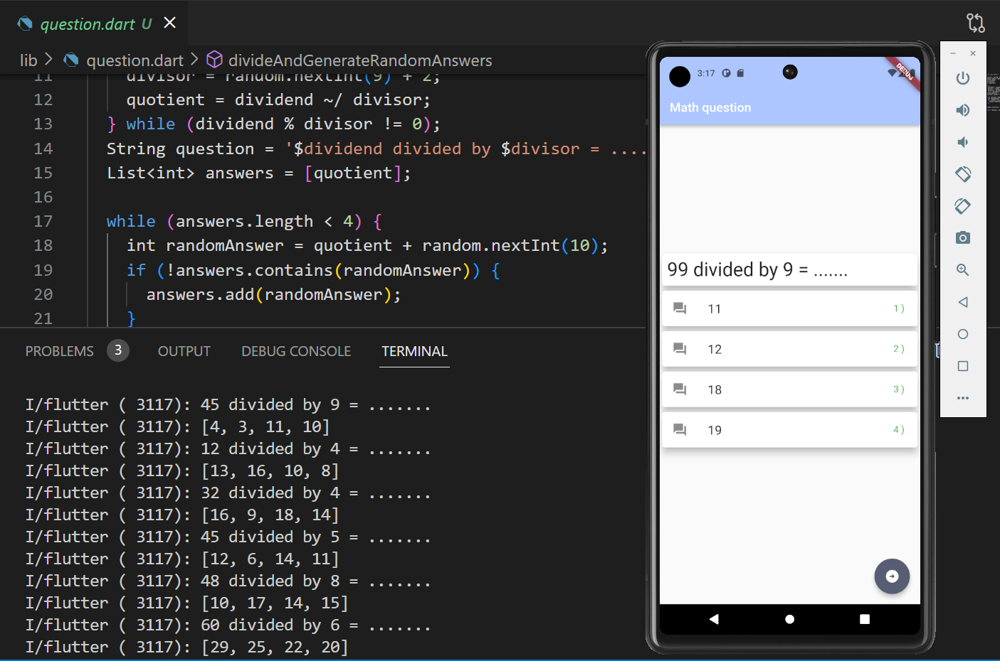
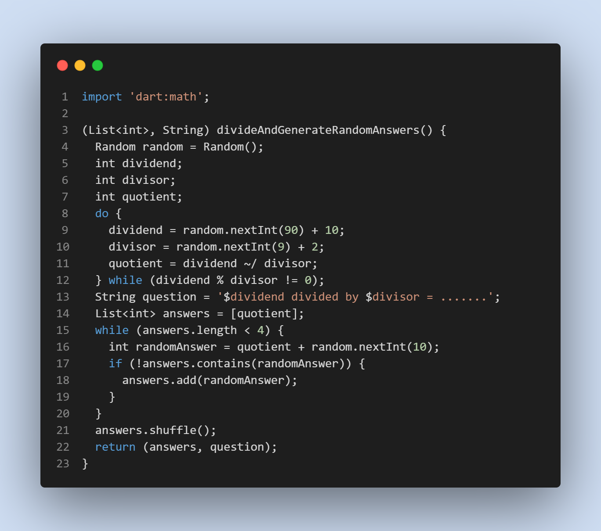
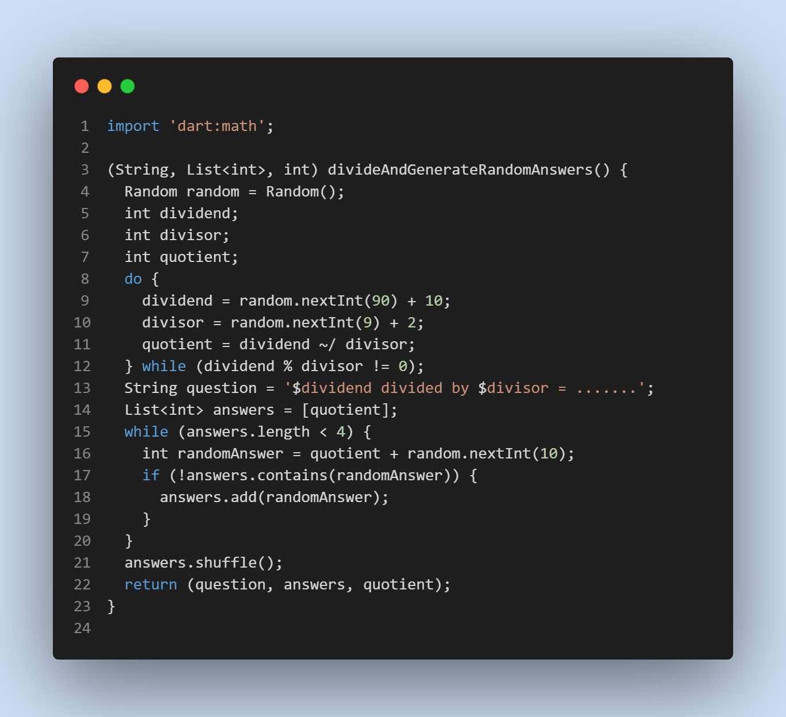

# Division random question App

The app can generate random multiplication questions.

## Table of Contents

- [Main](#Main)
- [ScreenShot](#ScreenShot)

## Main

The app can generate random multiplication questions. The multiplication questions are generated using a random number generator. The multiplication questions are displayed on the screen. The dividend must divisable by the divisor.

## ScreenShot

Without correct answer

With correct answer

